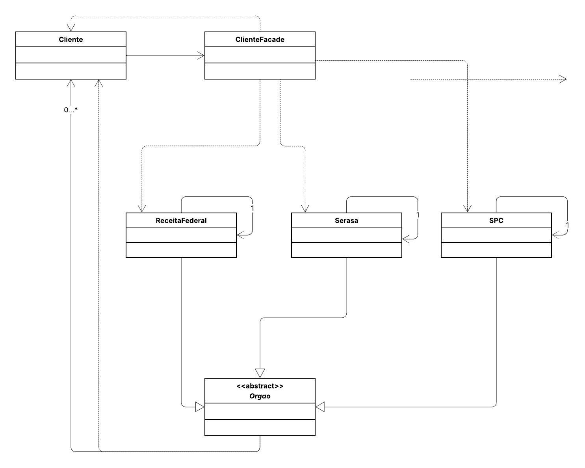

## 💰 Sistema de Aprovação de Empréstimo Bancário

Este projeto implementa o padrão de projeto estrutural **Facade**.

O objetivo é ocultar a complexidade das interações entre o cliente e diversos órgãos de verificação de crédito (subsistemas). Através da classe `ClienteFacade`, o sistema fornece uma interface simples e única para verificar se um cliente possui pendências em órgãos como **SPC**, **Serasa** e **Receita Federal** antes de aprovar um empréstimo.

O projeto aplica o princípio de desacoplamento, permitindo que a classe `Cliente` não precise conhecer a lógica ou a existência de cada órgão individualmente, interagindo apenas com a fachada para realizar a operação complexa de verificação.

## 📌 Diagrama de Classes

## 👩‍💻 Autora

**Eduarda Araujo Carvalho**
